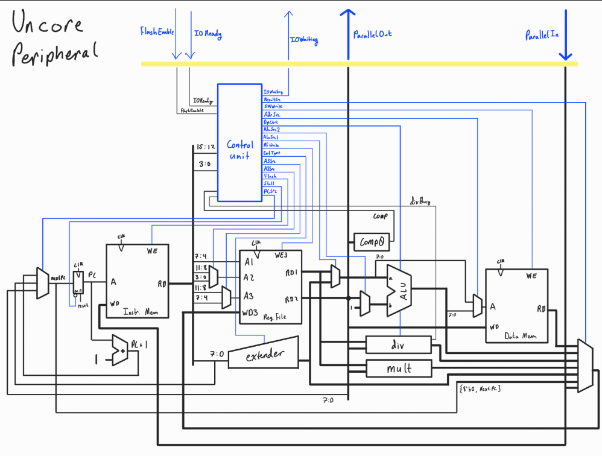

# ConfusedCore
The ConfusedCore project is a hardware implementation of Harvey Mudd Miniature Machine (*hmmm*), a toy example of a computer instruction set architecture that is used to teach assembly language programming to students taking the introductory computer science course at Harvey Mudd College.  

### Goals
Since the *hmmm* ISA is for educational use and otherwise trivial, the main goal for this project is to excercise my ability to design computer hardware at the microarchitecure level to meet ISA specifications and other design constraints, as opposed to ever fabricating physical hardware. Secondary to this goal is to create a teaching tool to demonstrate to students how thier assebled programs are physcially executed in hardware, which can be a difficult concept to grasp. 
### Design
Major inspiration for the design comes from *Digital Design and Computer Architecture* by Harris and Harris (see /ConfusedCore/ACKNOWLEDGEMENTS.md). With that general framework, heavy modification and expansion was needed to implement all 22 unique instructions of the *hmmm* ISA. The entire design process is outlined in /ConfusedCore/docs/*
### Verification
The verification plan for the processor involves a SystemVerilog textbench module to test the design in simulation using software such as ModelSim or Questa. The testbench flashes code to instruction memory before executing and verifying the results of this test program. Further information about verification can be found in ConfusedCore/test. 
### Future Plans 
Although somewhat trivial, the ConfusedCore could be heavily optimized and fortified from its current design. Since the design relies on the user only attemping to execute valid *hmmm* code, it would be interesting to add memory address checkers to flag illegal accesses as well as implement other exceptions such as division by zero.  
Additionally, the only input and output for the core comes in the form of two 16-bit parallel ports. Currently, the uncore peripheral that interfaces these busses with the user is responsible for preventing aperture time violations stemming from these signals, which must settle with adequate time to reach the register file through the result multiplexer before the next rising clock edge while IOReady is asserted. It would be more effective to use synchronizers to interface the asynchronous external signal with the synchronous logic of the processor.  
Similarly, it would be an interesting excersize to change the parallel ports to some sort of serial bus protocol. Even better, these ports could be changed to GPIO pins, but since memory mapped IO doesn't meet the ISA's standard for the read and write instructions, the parallel or serial busses would likely still be required.  
Another reach goal would be to model the processor in a spice program such as LTSpice or circuitverse, as doing so would greatly contribute to the secondary goal of creating an effective teaching tool for introductory computer science students. 