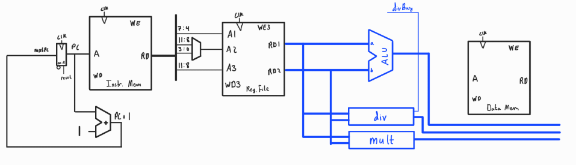

# the ConfusedCore Project
An attempt to develop hardware for the Harvey Mudd Miniature Machine (*hmmm*) ISA.  
Created by Corey Hickson chickson@hmc.edu - Summer 2024

This markdown file documents the design of the block diagram and top level module for this project. It begins with the ISA specifications and design constraints before gradually implementing all necessary instructions. All of the blocks/modules described here are either self explanatory or have their own documentation in the ConfusedCore/docs directory. 

## the *hmmm* ISA
*hmmm* is a toy ISA and teaching tool for the introductory Computer Science class at Harvey Mudd College. Students learn to write assembly code and execute their assembled programs in a simulator written in Python. As such, the designers of this ISA likely prioritized programmer friendliness over hardware considerations. 

*hmmm* assembly language has 26 total instructions (counting 4 psudeoinstructions), each with a 16 bit binary encoding. This ISA has extensive documentation as well as a Python assembler and simulator, all of which can be found at on the official documentation page: https://www.cs.hmc.edu/~cs5grad/cs5/hmmm/documentation/documentation.html#Machine.  
  
The 16 bit instruction binaries are organized into 4 different general formats:

| Format     | 15:12   | 11:8                 | 7:4                | 3:0                 | Examples 
| :-         | :-      | :-                   | :-                 | :-                  | :-      
| Reg Type   | Op Code | Destination Register | Source Register 1  | Source Register 2   | add, sub, mul, div, mod
| Imm Type   | Op Code | Destination Register | Immediate $_{7:4}$ | Immediate $_{3:0}$  | setn, addn, loadn, storen, j*xxx*n, calln
| Mem Type   | Op Code | Destination Register | Address Register   | Function Identifier | loadr, popr
|            | Op Code | Source Register      | Address Register   | Function Identifier | storer, pushr
| PC Type    | 0000    | Destination Register | 0000               | Function Identifier | read
|            | 0000    | Source Register      | 0000               | Function Identifier | write, jumpr
|            | 0000    | 0000                 | 0000               | 0000                | halt

Since there are only 4 bits allocated for the main Op Code and 22 unique instructions, it is necessary for some instructions to share Op Codes. Some less common instructions that access 2 registers use the last unused 4 bits to further disambiguate the instruction. I am calling this the *function identifier* in leau of any official naming conventions from the *hmmm* documentation. 
Similarly, I came up with these format names as there is little information on the instruction binaries, as intro CS students need not worry about them. Reg type takes two register arguments, Imm type takes an immediate argument, Mem type access data memory, and PC type set to the program counter or stop it from incrementing due to a stall or halt. 
3 of the 4 PC type instructions are special cases that likely only exist for the convenience of the beginner programmers using this ISA. Although these would likely not exist in a typical processor, they are built into the ConfusedCore in order to ensure that an arbitrary *hmmm* program could be executed, albeit with the need for uncore periferals to handle the I/O instructions. 

## General Design Considerations
* **Bus Sizes and Memory**  
The bus and memory sizes are largely governed by the specifications of the ISA. *hmmm* has 16-bit instructions, 16 16-bit register with 4-bit addresses, and 8-bit memory addresses for a total of 256 16-bit words of word addressable memory for instruction and data. By separating instruction and data memory, the programmer may execute 256 instructions and access all 256 words of data memory, giving them twice as much total memory compared to the unified memory of the *hmmm* Python simulator. Since both the isntruction and data memories will be the same size as the simulator's unified memory, any programs written for the simulator will execute as expected on the ConfusedCore. However, it is possible that a programmer writes a memory intensive program for the ConfusedCore that cannot execute in the simulator. That being said, this is incredibly unlikely as there does not yet exist an assebler for the ConfusedCore. 
* **Instruction Format**  
From the instruction formats outlined above, the only consistency is bits 15:12 being used as an Op Code and (unlike RISC-V) all immediates are kept in the same bits (7:0). This makes the immediate easier to process for arrithmetic since it does not need to be pasted together from bits all across the instruction. A notable challenge is that bits 11:8 can be both a source and destination register, so while only bits 11:8 can be the destination, all three of 11:8, 7:4, and 3:0 can be sources. This means that the addresses must be multiplexed to avoid adding additional ports to the register file. Since bits 11:8 and 3:0 are never source registers simultaneously, they will be multiplexed for one read port while bits 7:4 can be connected directly to the other read port. 
* **I/O**  
Another quirk of *hmmm* is the specialized input and output instructions, read rX and write rX, which take allow the use to directly write to or read from a register, respectively. While memory mapped general purpose I/O would be able to handle this without special input instructions, these special instructions likely exist to keep beginner programers from getting into the weeds of a memory map. To keep backwards compatibility with all assembled *hmmm* binaries, the ConfusedCore microarchitecture should accomodate these special instructions.
* **Multicycle Instructions**
Some instructions require multicycle latency either due to their nature (as with I/O) or to avoid excess hardware. I/O instructions stall to wait for input from an uncore peripheral and as such must stall the core until the input is ready. It is known that combinational division is expensive so multicycle latency is the best option. Similarly, since pushr and popr are more similar to CISC instructions (since they perform a memory access and register read and write), it may be necessary to have multicycle latency for popr, which needs to write to two registers.  
* **Assume Valid Program**
The design of this processor assumes that the flashed program has been assembled successfully using the *hmmm* assembler. As such, there is presently no verification of memory addresses or other protections. However, this is something that could be added in the future. See ConfusedCore/README.md for future plans for the project

## Building the Datapath  

The design approach for designing the datapath was to implement each different type of instruction one at a time. However, to avoid endless redesign, each new element was designed with all of the others in mind, along with the general design considerations above. Before routing any blocks together, the design begins with blocks for an instruction memory, data memory, register file, and program counter flip-flop (With an inverted enable signal to allow the datapath to be stalled for multicycle operations), and signals for the program counter (***PC*** $_{7:0}$), clock (***clk***), and ***reset***. At the rising clock edge, the program counter is updated to the input of the PC Flop, ***NextPC*** $_{7:0}$, which for the moment will simply be the current ***PC*** incremented by 1.   

  

### Reg Type Instrictions  

 After ***NextPC*** is passed through the flop on the rising clock edge, the instruction if fetched from instruction memory using ***PC*** as the read address. From there, the instruction (***Instr*** $_{15:0}$) is decomposed to access the different components. Bits 15:12 are always the Op Code, and will be handled by the controller. The other three 4-bit nibbles that make up the instruction act as source and destination register addresses for Reg Type Instructions. If souce and destination registers were consisten (as is the case with RISC-V), then these bits from ***Instr*** could be routed directly to the register file address inputs. However, as noted previously, bits 11:8 can be both a source and a destination register. By inspecting, we see that bits 11:8 and 3:0 are never both source registers simultaneously, so the two can be multiplexed for one of the read ports, while bits 7:4 can be connected directly to the other read port. Additionally, only bits 11:8 act as a destination register, so they can be comnnected to the only write port of the register file.  

  

After the registers are read to create the signals ***RD1*** $_{15:0}$ and ***RD2*** $_{15:0}$, the integers they contain are used in arrithmetic operations. A simple ALU handles addition and subtration with the, a designated multiplier block handles combinational multiplication, and a multicycle division block handles division and modulo. Since the division operation has multicycle latency, it must create a busy signal (***DivBusy***) to tell the controller to stall the processor until the division is complete. These blocks have output signals ***ALUOut*** $_{15:0}$, ***MultOut*** $_{15:0}$, and ***DivOut*** $_{15:0}$, respectively.  

  

Finally, since these instructions do not access data memory, all thats left to do is multiplex their outputs to the signal Result $_{15:0}$ and write back to the desitnation register via the write data input on the register file block. 

  

With that, apart from combinational and sequential control logic described later, the ConfusedCore is able to execute 5 of the 22 unique *hmmm* instructions.

### Imm Type Instructions  

For Imm Type instructions, bits 7:0 of ***Instr*** must be extended to 16 bits to be compatible with the existing datapath. For arithmetic operations (addn, setn) the 8 bits are interpreted as a two's complement integer while for jumps and memory operations (loadn, storen, j*xxx*n, calln) they are interpreted as an 8 bit unsigned address. A sign extender block takes care of both of these cases to prepare the immediate for its use in the datapath, with the output signal ***ExtImm*** $_{15:0}$.

   

For setn, ***ExtImm*** can be input to the multiplexer that drives the ***Result*** signal to write the immediate to the destination register. As for addn, ***ExtImm*** must be multiplexed with the contents of the register addressed by bits 7:4 of ***Instr*** (***RD1***) to produce the second ALU input. 

   

For loadn and storen, the 8 bit address used to access data memory must be taken from bits 7:0 of the immediate. However, since loadn and storen will use the contents of the register addressed by bits 7:4 of ***Instr***, the 8 bits can be sampled after the multiplexer used to pick the first ALU input to reuse this block. For loadn, the read data output from data memory (***DMEMOut*** $_{15:0}$) is added as an input to the multiplexer driving ***Result*** so the read data can be written back to the desitnation register. For storen, the data to write to memory comes from the the register contents addressed by bits 11:8 of ***Instr***, so ***RD2*** is connected to the write port on the data memory module. 

For the jump instructions ending in n (jeqzn, jnezn, jgtzn, jltzn) and calln, the immediate must be multiplexed with the incremented PC (***PCPlus1*** $_{7:0}$) to drive ***NextPC*** in order to set the program counter to the arbitrary unsigned integer in the immediate field of the instruction. Additionally, calln requires that ***PCPlus1*** (the return address) to be written to a register, which requires the signal to be zero extended and added as an input to the result multiplexer. Finally, the conditional jumps require a comparator to determine the relationship between ***RD2*** and zero, which produces a two bit signal ***Comp*** $_{1:0}$. The controller will use this to determine the source signal for the PC multiplexer. 

  

And now, with setn, addn, loadn, storen, jeqzn, jnezn, jgtzn, jltzn, and calln implemented, 14 of the 22 *hmmm* instructions have been implemented. 

### Mem Type Instructions  

The four Mem type instructions (loadr, storer, popr, pushr) all write to or read from data memory. As previously noted, the current architecture supports loadr and storer by sampling bits 7:0 of the first ALU input after multiplexing between RD1 and the immediate.  

As for pushr and popr, we must add hardware to post-increment or pre-decrement the source register, respectively. Since the sampling of the address bits comes before the ALU in the datapath, we can use the ALU to add or subtract 1 from the source register before writing it back to the register file. However, since bits 11:8 of ***Instr*** are connected directly to the write data port on the register file, a new multiplexer is needed to select between these bits and bits 7:4, which address the register that needs to be incremented or decremented.  

Additionally, since the decrement needs to happen before the memory access for a popr, we must now multiplex the data memory address input with bits 7:0 of ***ALUOut***. 

  

With these modifications, loadr, storer, popr, and pushr are implemented. As such, 18 of the 22 unique *hmmm* instructions can be executed by the ConfusedCore processor.  

### PC Type Instructions  

read, write, jumpr, halt

Finally, the special PC type instructions require minimal changes to the datapath to be implemented. No additional hardware is needed for halt, as the controller will simply stall the program counter flop until reset after finding the Op code and function ID that are all 0, since halt is the only valid instruction where this is the case. For jumpr, ***RD2*** must simply be routed into the PC multiplexer.  

  

For read and write, input and output parallel busses (***ParallelIn*** $_{15:0}$, ***ParallelOut*** $_{15:0}$) are connected to the result multiplexer and ***RD2***, respectively. Additionally, ***ParallelIn*** can be routed to the write data port on the instruction memory block to made use of this port for flashing programs to instruction memory.  

  

And Finally, with read, write, jumpr, and halt, the datapath is ready to handle all 22 instructions of the *hmmm* ISA.  

## Building the Controller  

To begin building the controlled, it is best to list off all of the control signals that the datapath requires. Inspecting the datapath left to right, we see that the following signals are needed:  

| Signal                    | Type   | Purpose  
| :-                        | :-     | :-  
|***PCSrc*** $_{1:0}$       | Output | Select ***NextPC*** from the three potential sources
|***Stall***                | Output | Stall the PC flop during multicycle operation or halt
|***Flash***                | Output | Enable writing to instruction memory during program flash
|***A2Src***                | Output | Select between the two possible addresses for read port 2 in the register file
|***A3Src***                | Output | Select between the two possible addresses for write port 3 in the register file
|***ExtType***              | Output | Tell the extender block to do sign or zero extension on the immediate
|***RFWrite***              | Output | Enable writing to the register file
|***ALUSrc1***              | Output | Select between the two possible sources for the first ALU argument
|***ALUSrc2***              | Output | Select between the two possible sources for the second ALU argument
|***OpCtrl*** $_{1:0}$      | Output | Tell arithmetic blocks which operation to perform (add, sub, div, mod)
|***AdrSrc***               | Output | Select between two possible addresses for data memory 
|***DMWrite***              | Output | Enable writing to data memory
|***ResultSrc*** $_{3:0}$   | Output | Select between the seven potential results to write to the register file
|***Instr*** $_{15:12}$     | Input  | Get the op code from the instruction
|***Instr*** $_{3:0}$       | Input  | Get the function ID for instructions that need it
|***Comp*** $_{1:0}$        | Input  | Relay the relationship between ***RD2*** and zero for conditional jumps
|***DivBusy***              | Input  | Tell the controller that the division block is busy with a multicycle operation

Additionally, the following signals are needed to communicate with the uncore peripheral that handles I/O and program flashing:  
| Signal | Type | Purpose 
| :-                        | :-     | :-  
|***IOWaiting***            | Output | Tell the uncore peripheral that the processor is waiting for input 
|***IOReady***              | Input  | Tell the controller that the input on the ***ParallelIn*** bus is ready to be sampled
|***FlashEnable***          | Input  | Signal the controller to begin flashing code via the ***ParallelIn*** bus

The controller will contain combinational logic for the standard single cycle operations and sequential logic for multicycle operations and halts, which is be outlined in ConfusedCore/docs/controller.md. However, with these signals outlined, a controller block can be added to the diagram with all control signals routed through it.  

  

And with that, the top level design of the ConfusedCore processor is complete. All that's left is to fill in the blocks in the top level diagram. See ConfusedCore/docs/* for documentation of all nontrivial blocks that make up this block diagram.  

